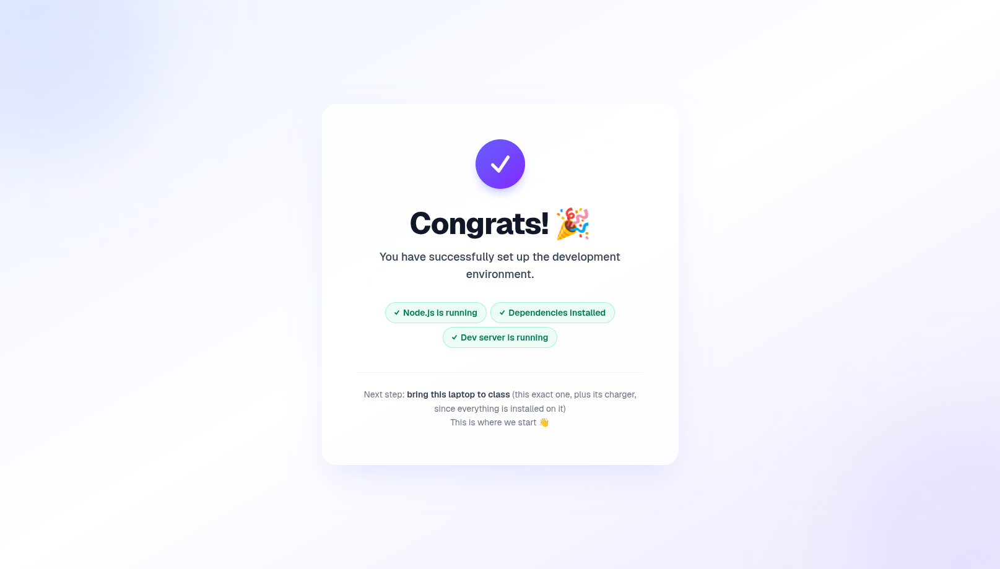

# class-starter

[Read this in Chinese → README.zh.md](README.zh.md)

This is the course's **starter project**. When it runs, you'll see a congratulations page. On Day 1 we build on this same project, step by step, until it becomes a system for your team.

**It has one job: run on your laptop.** If it runs, your development tools (Node, git, an editor) are set up correctly, and you can start building on Day 1.

**Easiest way: follow [Pre-class Part 2](https://pre-class-prep.vercel.app/part2).** Codex (the coding agent inside the ChatGPT Desktop App) downloads this project into `AI Class/class-starter` on your Desktop, installs everything, and opens the page for you. You don't need the commands below.

Use the steps below only if you'd rather do it by hand, or if a helper asks you to.

---

## Doing it by hand (about 10 minutes)

**Step 1 · Open a terminal**

- **Mac**: press `Cmd + Space`, type `Terminal`, press Enter
- **Windows**: search the Start menu for `PowerShell` and open it (⚠️ not "Command Prompt" / cmd)

**Step 2 · Go to your course folder** (`AI Class` on your Desktop; this creates it if it's missing)

Mac:
```bash
mkdir -p ~/Desktop/"AI Class" && cd ~/Desktop/"AI Class"
```

Windows (PowerShell):
```powershell
New-Item -ItemType Directory -Force "$HOME\Desktop\AI Class"; Set-Location "$HOME\Desktop\AI Class"
```

**Step 3 · Run these 4 commands one at a time** (wait for each to finish before pasting the next)

```bash
git clone https://github.com/lavaxun/class-starter.git
```
> Downloads the project into a folder called `class-starter`

```bash
cd class-starter
```
> Moves into that folder

```bash
npm install
```
> Installs the parts the project needs. **This takes a few minutes**, and lots of scrolling text is normal

```bash
npm run dev
```
> Starts it! When you see `Local: http://localhost:3000`, it's running

**Step 4 · Open your browser** and go to **http://localhost:3000**

A big "Congrats! 🎉" page = success ✅



**Step 5 · Bring this laptop to class**: this exact one, since everything is installed on it 🎉

---

## Common problems

| Problem | Fix |
|---|---|
| `npx` or `npm` says "command not found" | Node isn't installed properly. Install Node, then **close and reopen the terminal** and try again |
| `npm install` hangs for a long time or shows errors | Switch networks (a phone hotspot is often faster) and run `npm install` again |
| The page won't open | Make sure the terminal is still open and `npm run dev` is still running (close it and the page stops) |
| You want to stop it | Press `Ctrl + C` in the terminal. To start again, go into the `class-starter` folder and run `npm run dev` |
| Stuck for more than 10 minutes | Don't struggle alone. Come a little early on Day 1 and we'll sort it out with you on the spot |

---

## Don't delete this folder

On Day 1 you open this `class-starter` folder in Codex, and Codex adds the workshop house rules to the project's `AGENTS.md` (the file Codex reads for your project's rules). Nothing about house rules needs setting up before class.

Feel free to click around beforehand. If you break something, that's fine: rename the old `class-starter` folder to `class-starter-old`, then run the commands above again and you'll get a fresh copy.
